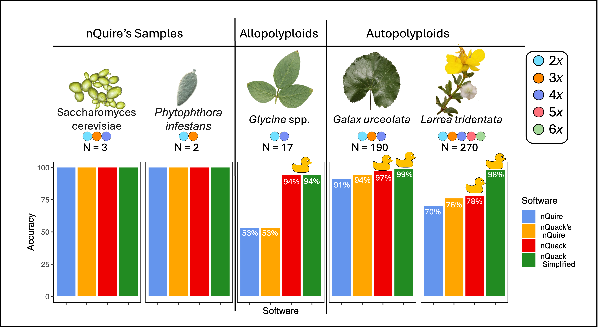

# nQuack


**Michelle L. Gaynor, Jacob B. Landis, Tim K. O'Connor, Robert G. Laport, Jeff J. Doyle, Douglas E. Soltis, José Miguel Ponciano, and Pamela S. Soltis**

[](https://www.gnu.org/licenses/gpl-3.0)

## Overview

nQuack is a modified statistical framework to predict ploidy level based on sequence data. We build upon [Weib et al., 2018](https://doi.org/10.1186/s12859-018-2128-z) Gaussian Mixture Model approach to estimate ploidy level, which was originally written as [a C executable](https://github.com/clwgg/nQuire).

## More on nQuack

Here we provided expanded tools and implementations to improve site-based heterozygosity inferences of ploidal level.

nQuack provides data preparation guidance and tools to decrease noise in input data. These include a maximum sequence coverage quantile filter and sequence error-based filter, to remove biallelic sites that are likely not representative of copy number variance in the nuclear genome. We also consider only the frequency of allele A or B at each site, instead of both, as found in other methods. To learn more about best practices, see our [Data Preparation](https://mlgaynor.com/nQuack/articles/DataPreparation.html) guide.

Our model improves upon the nQuire framework by extending it to higher ploidal levels (pentaploid and hexaploid), correcting the augmented likelihood calculation, implementing more suitable distribution, and allowing additional 'fixed' models. We also decrease model selection errors by relying on BIC rather than likelihood ratio tests. To learn more about these methods, see our [Model Options](https://mlgaynor.com/nQuack/articles/ModelOptions.html) guide.

We provide 32 ways to estimates likelihood of a mixture of models with the expectation maximization algorithm ([see more here](https://mlgaynor.com/nQuack/articles/ModelOptions.html)) - 8 expectation maximization implementations with 4 model types each. In total, nQuack offers 128 models.

## Evaluation of nQuack



**Figure 1**. Accuracy of nQuire, nQuack's implementation of nQuire, nQuack's best model, and a simplified version of nQuack across data sets.

To examine the utility of this method, we examined 513,792 models based on both simulated and real samples. Figure 1 depicts the accuracy of our method across our included data sets. More information on nQuack's implementation of nQuire can be found on [our pkgdown site](https://mlgaynor.com/nQuack/articles/ModelOptions.html) and in the [Appendix S1](https://www.doi.org/10.1002/aps3.11606). In Figure 1, the simplified version of nQuack only classifies samples as diploid or polyploid - though this is not ideal, it is accurate!

Before using this method, we suggest you read our manuscript and consider the many limitations to a pattern-based approach for determining ploidal level.

## Installation

```         
install.packages("devtools")
devtools::install_github("mgaynor1/nQuack")
```

### Warning: samtools must be local!

If you are working on your personal computer, make sure samtools is installed and callable as "samtools" via terminal. If you are working on a cluster, you may need to symbolically-link samtools locally. Though the location of install may differ, here is how I make samtools callable locally on UF's amazing [HiPerGator](https://www.rc.ufl.edu/about/hipergator/) slurm cluster - note, the following should be run in your home directory (i.e., 'pwd' = /home/username) :

```         
mkdir bin
cd bin
ln -s /apps/samtools/1.15/bin/samtools samtools
```

Thanks to [jessiepelosi](https://github.com/jessiepelosi), here is another option:

```         
Sys.setenv(PATH=paste("/apps/samtools/1.19.2/bin", Sys.getenv("PATH"),sep=":"))
```

For implementation, see our [Basic Example](https://mlgaynor.com/nQuack/articles/BasicExample.html) article.

## References

Gaynor ML, Landis JB, O'Connor TK, Laport RG, Doyle JJ, Soltis DE, Ponciano JM, and Soltis PS. 2024. nQuack: An R package for predicting ploidy level from sequence data using site-based heterozygosity. *Applications in Plant Sciences* 12(4):e11606. [doi: 10.1002/aps3.11606](https://www.doi.org/10.1002/aps3.11606)

## Up Next:

-   If you have sequence data with known plodial level for a mixed-ploidy system, let us know. We would love to collaborate with you. To be included in v2.0, please send me an email at shellyleegaynor at gmail.
