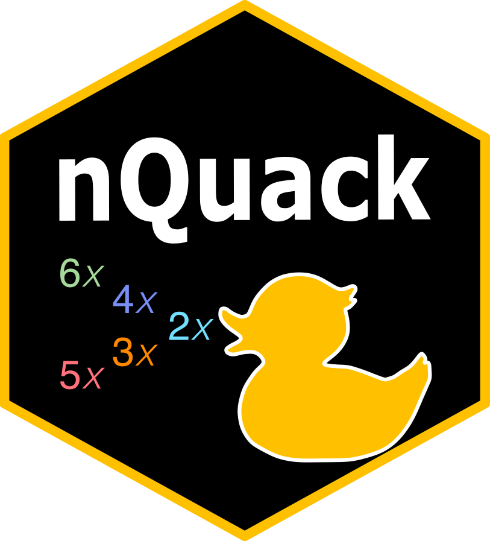

# nQuack
.  

 

nQuack is a modified statistical framework to predict ploidy level based on sequence data. We build upon [Weib et al., 2018](https://doi.org/10.1186/s12859-018-2128-z) Gaussian Mixture Model approach to estimate ploidy level, which was originally written as [a C executable](https://github.com/clwgg/nQuire).

Data Preparation:
- Input data is a BAM

- Instead of a Gaussian Mixture Model, we use a Beta Mixture Model. The Gaussian distribution ranges from -Inf to Inf, while a Beta distribution is from 0 to 1. Since allele frequencies range from 0 to 1, a Beta distribution is more suitable.    
- The probability denisty calculation includes correction for the truncated distribution of data. Since the allele frequencies are filtered to   

