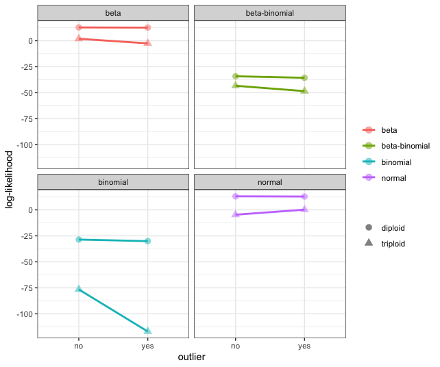
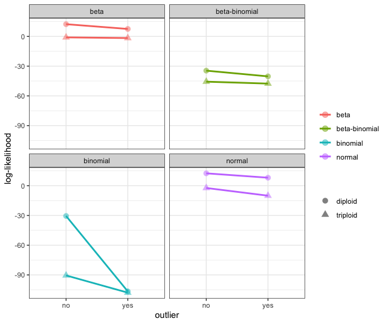

# Outliers

Here we examine the effect of high coverage outliers.

## Simulate Data

Following Figure S2 from WeiB et al. 2018 (nQuire), we simulate 10 sites
with a binomial distribution with a probability of 0.5 and coverage
equal to 100. For the data set with an outlier, we simulate a single
site with the coverage equal to 400.

``` r
dipNorm <- data.frame(matrix(ncol = 3, nrow =10))

for(i in 1:10){
  dipNorm[i,1] <- 100
  dipNorm[i,2] <- rbinom(n = 1, size = 100, prob = 0.5)
  dipNorm[i,3] <- dipNorm[i,1] - dipNorm[i,2]
}
```

``` r
dipBias <- data.frame(matrix(ncol = 3, nrow =10))
coverage <- c(rep(100, 9), 400)
prob <- c(rep(0.5, 9), 0.5)
for(i in 1:10){
  dipBias[i,1] <- coverage[i]
  dipBias[i,2] <- rbinom(n = 1, size = coverage[i], prob = prob[i])
  dipBias[i,3] <- dipBias[i,1] - dipBias[i,2]
}
```

## Comparing the Log-Likelihood

We then calculate a simple log-likelihood given the expected parameter
values for a diploid and triploid model. In all cases, we found the
diploid to be the most likely model for the simulated data. Unlike the
simulations from nQuire, we do not find as dramatic of an effect on
log-likelihood calculations from outliers. We attempted to partition the
data to match Figure S2 from WeiB et al. 2018, however, we never could
create the binomial distribution with the most likely model as the
triploid.



However, when the allele frequency of the high coverage outlier deviates
from the expected (in this case, we set the probability as 0.2), we do
see that the log-likelihood for the binomial and normal distributions
are greatly effected by this outlier. However, we find that the diploid
model is more likely in all cases. Noteably, we only see small shifts in
the log-likelihood associated with the beta and beta-binomial
distributions.



## TLDR

The beta and beta-binomial distributions look promising. And we do not
find as dramatic of an effect on log-likelihood calculations from
outliers as previously reported.the beta and beta-binomial distributions
