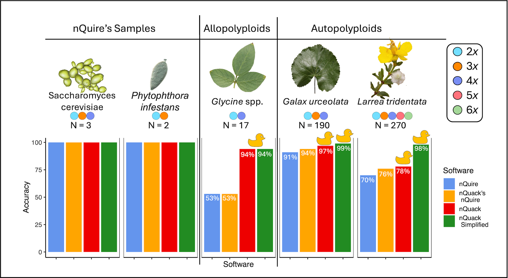

# nQuack

**Michelle L. Gaynor, Jacob B. Landis, Tim K. O’Connor, Robert G.
Laport, Jeff J. Doyle, Douglas E. Soltis, José Miguel Ponciano, and
Pamela S. Soltis**

## Table of Contents

[Overview](#overview)  
[How to use nQuack](#how-to-use-nquack)  
[Installation](#installation)  
[More on nQuack](#more-on-nquack)  
[Accuracy of nQuack](#evaluation-of-nquack)  
[Citation](#reference)  
[Collaboration Opportunity](#up-next)

## Overview

nQuack is a modified statistical framework to predict ploidy level based
on sequence data. We build upon [Weib et al.,
2018](https://link.springer.com/article/10.1186/s12859-018-2128-z)
Gaussian Mixture Model approach to estimate ploidy level, which was
originally written as [a C executable](https://github.com/clwgg/nQuire).
In our model, we provide a match to nQuire with
[`quackNormalNQ()`](http://mlgaynor.com/nQuack/reference/quackNormalNQ.md).
Note, to match the original software, we use an incorrect likelihood in
the expected maximization algorithm for
[`quackNormalNQ()`](http://mlgaynor.com/nQuack/reference/quackNormalNQ.md)
(see publication supplement for more information). For the corrected
normal, please use
[`quackNormal()`](http://mlgaynor.com/nQuack/reference/quackNormal.md).
Here, the equivalent to nQuire is with a uniform mixture with fixed_3.

Before using this method, we suggest you read our manuscript and
consider the many limitations to a pattern-based approach for
determining ploidal level. However, we attempted to highlight the most
important take-aways here and in our documentation.

## How to use nQuack

### Input Data

Input data for nQuack can be a [BAM
file](https://mlgaynor.com/nQuack/articles/DataPreparation.html),
[Output from
nQuire](https://mlgaynor.com/nQuack/reference/process_nquire.html), a
[VCF](https://mlgaynor.com/nQuack/articles/VCF2nQuack.html), [Output
from
Qploidy2](https://mlgaynor.com/nQuack/articles/Qploidy2nQuack.html), and
more. See the [pkgdown site](https://mlgaynor.com/nQuack/) for more
information on [preparing your
data](https://mlgaynor.com/nQuack/articles/DataPreparation.html) for
nQuack.

For modeling, you must input a matrix `xm` which contains two columns
with total coverage and coverage for a randomly sampled allele across
sites for a single individual.

### Ploidy Prediction

As shown in Gaynor et al. (2024), both nQuire and nQuack are not the
most accurate models. To use this method or nQuire, you should have a
set of samples with known ploidal level:

**Step 1. Identify the most accurate filtering and modeling approach
(distribution and type) based on your samples with known ploidal
level.**

- Comparing BIC score among all distributions and types is not accurate.
  You must assess accuracy with a set of samples with known ploidal
  level.
  - Gaynor et al. (2024): “Neither nQuack nor nQuire should be used to
    infer the ploidy in a system for which very little is known, as
    these models are often positively misleading.”  
- **Distributions**: Normal, Beta, and Beta-Binomial + with or without a
  uniform mixture. = 6 options!
- **Type** indicates which parameter is estimated.
  - Type: “fixed” = only alpha free, “fixed_2” = only alpha and variance
    free, “fixed_3” = only variance free = 3 options!
- If you do not identify one of the 18 modeling approaches
  (distributions + type combinations) as accurate, you likely need to
  reprocess your raw data.

**Step 2. Apply the best filtering approach and best model to all
unknown samples.**

See [Basic
Example](https://mlgaynor.com/nQuack/articles/BasicExample.html) for
step-by-step guidance.

Note, we know this is limited and often you will not have samples with
known ploidal level. Stay-tuned, we are currently working on a better
model trained on 10k samples provided by over 70 collaborators. If you
want to join the team, there is still time - reach out!

## Installation

    install.packages("devtools")
    devtools::install_github("mgaynor1/nQuack")

Warning: samtools must be local!

If you are working on your personal computer, make sure samtools is
installed and callable as “samtools” via terminal. If you are working on
a cluster, you may need to symbolically-link samtools locally. Though
the location of install may differ, here is how I make samtools callable
locally on UF’s amazing [HiPerGator](https://it.ufl.edu/rc/hipergator/)
slurm cluster - note, the following should be run in your home directory
(i.e., ‘pwd’ = /home/username) :

    mkdir bin
    cd bin
    ln -s /apps/samtools/1.15/bin/samtools samtools

Thanks to [jessiepelosi](https://github.com/jessiepelosi), here is
another option:

    Sys.setenv(PATH=paste("/apps/samtools/1.19.2/bin", Sys.getenv("PATH"),sep=":"))

## More on nQuack

Learn more about nQuack by checking out our articles:

- [Basic
  Example](https://mlgaynor.com/nQuack/articles/BasicExample.html)
- [Data
  Preparation](https://mlgaynor.com/nQuack/articles/DataPreparation.html)
- [Faster
  Example](https://mlgaynor.com/nQuack/articles/FasterExample.html)
- [Model
  Options](https://mlgaynor.com/nQuack/articles/ModelOptions.html)
- [Simulate
  Data](https://mlgaynor.com/nQuack/articles/SimulateData.html)
- [Outliers](https://mlgaynor.com/nQuack/articles/Outliers.html)
- [VCF to nQuack](https://mlgaynor.com/nQuack/articles/VCF2nQuack.html)
- [Qploidy2 to
  nQuack](https://mlgaynor.com/nQuack/articles/Qploidy2nQuack.html)
- [FAQ](https://mlgaynor.com/nQuack/articles/FAQ.html)

With nQuack, we provided expanded tools and implementations to improve
site-based heterozygosity inferences of ploidal level.

nQuack provides data preparation guidance and tools to decrease noise in
input data. These include a maximum sequence coverage quantile filter
and sequence error-based filter, to remove biallelic sites that are
likely not representative of copy number variance in the nuclear genome.
We also consider only the frequency of allele A or B at each site,
instead of both, as found in other methods. To learn more about best
practices, see our [Data
Preparation](https://mlgaynor.com/nQuack/articles/DataPreparation.html)
guide.

Our model improves upon the nQuire framework by extending it to higher
ploidal levels (pentaploid and hexaploid), correcting the augmented
likelihood calculation, implementing more suitable distribution, and
allowing additional ‘fixed’ models. We also decrease model selection
errors by relying on BIC rather than likelihood ratio tests. To learn
more about these methods, see our [Model
Options](https://mlgaynor.com/nQuack/articles/ModelOptions.html) guide.

We provide 32 ways to estimates likelihood of a mixture of models with
the expectation maximization algorithm ([see more
here](https://mlgaynor.com/nQuack/articles/ModelOptions.html)) - 8
expectation maximization implementations with 4 model types each. In
total, nQuack offers 128 models.

## Evaluation of nQuack

**Figure 1**. Accuracy of nQuire, nQuack’s implementation of nQuire,
nQuack’s best model, and a simplified version of nQuack across data
sets.

To examine the utility of this method, we examined 513,792 models based
on both simulated and real samples. Figure 1 depicts the accuracy of our
method across our included data sets. More information on nQuack’s
implementation of nQuire can be found on [our pkgdown
site](https://mlgaynor.com/nQuack/articles/ModelOptions.html) and in the
Appendix S1 in our publication. In Figure 1, the simplified version of
nQuack only classifies samples as diploid or polyploid - though this is
not ideal, it is accurate!

Before using this method, we suggest you read our manuscript and
consider the many limitations to a pattern-based approach for
determining ploidal level.

## Reference

Gaynor ML, Landis JB, O’Connor TK, Laport RG, Doyle JJ, Soltis DE,
Ponciano JM, and Soltis PS. 2024. nQuack: An R package for predicting
ploidy level from sequence data using site-based heterozygosity.
*Applications in Plant Sciences* 12(4):e11606.

### Associated publications:

Schley RS, Piñeiro R, Nicholls J, Gaynor ML, Lewis GP, Pezzini FF,
Dexter KG, Kider C, Pennington RT, and Twyford AD. 2026. The frequency
and importance of polyploidy in tropical trees. *New Phytologist*.

## Up Next

- If you have sequence data with known plodial level for a mixed-ploidy
  system, let us know. We would love to collaborate with you. To be
  included in v2.0, please send me an email at shellyleegaynor at gmail.
