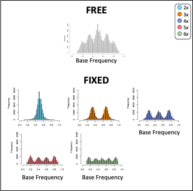

## Site-based heterozygosity
At a biallelic site in a diploid with allele's A and B, you expect to sequence both alleles in equal proportions with 50% of sequences representing A and 50% of sequences representing B. This simple idea is the foundation of all *site-based heterozygosity* methods. 

These approaches are based on biallelic single nucleotide polymorphisms within an individual and the expected number of copies of each allele. 

```{r echo=FALSE, out.width="50%", fig.align='center'}
knitr::include_graphics("../man/figures/TableofFreq.png",  dpi = 5000)
```


## nQuack

Like previous site-based heterozygosity approaches to predict ploidal level, we use a mixture model approach to estimate the most likely ploidal level. 

nQuack provides multiple implementations of the expected maximization (EM) algorithm, including implementations with:   

  (1) a normal distribution that mimics [nQuire](https://github.com/clwgg/nQuire),    
  (2) a corrected normal distribution,     
  (3) a beta distribution,    
  (4) a beta-binomial distribution.    

Each of the implementations are provided with and without uniform mixtures, for a total of eight implementations. 

Here we details these available implementations and how to use them.  

    
#### Model types  

nQuire's implementation of expected maximization for a normal distribution had two types of models: "free" where all variable were estimated and "fixed" where only variance was estimated. nQuire then calculate the log-likelihood ratio between the free and fixed models to identify if a sample was a diploid, triploid, or tetraploid. The simplest approach to expand this to higher ploidal levels is to just add these distribution to the fixed mixtures examined. 

```{r echo=FALSE, out.width="50%", fig.align='center'}

```

However, mixture models have additional components that might be helpful when predicting ploidal level. The figure below shows the basic components of a mixture model which include mean ($\mu$), variance ($\sigma$), and proportion (or alpha, $\alpha$). Of these components, we only have expectations for the mean, which are the expected frequencies of each allele, as seen in the table above. We know that proportions may differ for an allopolyploid compared to an autopolyploid, so we were interested in exploring models where alpha is free. 

```{r echo=FALSE, out.width="100%", fig.align='center'}
knitr::include_graphics("../man/figures/Figure02-ModelDesign.png",  dpi = 5000)
```

We ended up coding each implementation to provide estimates for all parameters free (`type = 'free'`), only alpha free (`type = 'fixed'`), only alpha and variance free (`type = 'fixed_2'`), and only variance free (`type ='fixed_3`). nQuire's fixed models only predict variance and resemble our `type = 'fixed_3'` implementation.


### Additional arguments.   
For each expected maximization function, a starting parameter list (`parm.list`) must be provided which includes `avec`, `mvec`, and `svec`, which represent $\alpha$, $\mu$, and $\sigma$ for each mixture. The length of each input `vec`tor should be equal, unless the distribution includes a uniform mixture, then `avec` should include a value for the uniform distribution. All values must be greater than 0 and less than or equal to 1, with `sum(avec)` equal to 1. 

For the normal and beta distributions, allele frequency should be provided (`xi`), however for the beta-binomial mixtures we expect total coverage and coverage for a randomly sampled allele (`xm`). Convergence of the algorithm occurs after the set `niters` or iterates, or when the difference between the augmented log-likelihood values is less than `epsilon`. We also allow truncation of the probability density function to match any allele frequency truncation that may have been done during data cleaning (`trunc`). 


Some notes:   

  - The equivalent to the nQuire model is our `emstepNU()` function.   
  - Implementations with Nelder-Mead numerical optimization are unable to estimate a single alpha value, therefore diploid mixtures cannot be estimated from `emstepB(type =  "fixed")`and `emstepBB(type = "fixed")` and the log-likelihood should be calculated based on the sum of the probability density functions of these mixtures.   
  - Both the beta and beta-binomial use Nelder-Mead numerical optimization, so they are computationally 'slow'.  
  - We provide packaged functions to apply these methods below. 
  

Expected maximization implementations can be found here:

  - Normal: `emstepNA()`
  - Normal with uniform: `emstepNUA()`
  - nQuire's normal: `emstepN()`
  - nQuire's normal with uniform: `emstepNU()`
  - Beta: `emstepB()`
  - Beta with uniform: `emstepBU()`
  - Beta-binomial: `emstepBB()`
  - Beta-binomial with uniform: `emstepBBU()`


```{r eval=FALSE, fig.align='center', include=FALSE}
Distributions <- c("Normal", "Normal-Uniform","Normal-Augmented", "Normal-Uniform-Augmented", "Beta", "Beta-Uniform", "Beta-Binomial", "Beta-Binomial-Uniform")
Function <- c("emstepN()", "emstepNU()", "emstepNA()", "emstepNUA()", "emstepB()", "emstepBU()", "emstepBB()", "emstepBBU()")
Input <- c("Allele Frequency","Allele Frequency", "Allele Frequency","Allele Frequency", "Allele Frequency", "Allele Frequency", "Coverage", "Coverage" )
emtable <- data.frame(Distributions, Function, Input)

knitr::kable(emtable, align = "c")
```

## Mixture model implementation.   

As we do not expect anyone to program the starting parameters needed to run each mixture model, so we have designed a few functions to help. 

### Implementation


  - `quackNormal()`
  - `quackNormalNQ()` 
  - `quackBeta()`
  - `quackBetaBinom()`

Each of these functions can run up to 32 mixture models each. A matrix with total coverage and coverage for a randomly sampled allele (`xm`) should be supplied to each of these functions. These functions can run in parallel if resources are avaliable. 

The input parameters for each mixture are based on the table above with variance equal to 0.01 and alpha divided equally among the expected frequencies. For example, for a triploid: `mvec = c(0.33, 0.67)`, `avec=c(0.50, 0.50)`, and   `svec=c(0.01, 0.01)`. When a uniform mixture is included, we allocate 0.1 of the avec to this mixture, therefore, `avec = c(0.45, 0.45, 0.1)`. For each function, the input mean and variance can be transformed based on sequencing error rate and sequencing overdispersion parameter (see supplemental methods for more information). Variance can also be set to 0.001. 


  - `bestquack()`
 
Sometimes you may not want to run 32 mixture models, so we created a function that lets you pick the distribution, type, and mixtures included. 


### Interpretation

Based on the above functions, users are able to obtain the BIC scores, log-likelihood, and log-likelihood ratios (or $\Delta\log{L}$) of each mixture. For BIC and $\Delta\log{L}$, the lowest value is  the most likely model. Based on log-likelihood, the highest value is the most likely model.

We recommend using the BIC which is penalized for both sample size and number of parameters estimated. BIC will lead to less errors in model selection (see Dennis et al. 2019).

To select the best model based on the model outputs, we provide the function `quackit()`.


